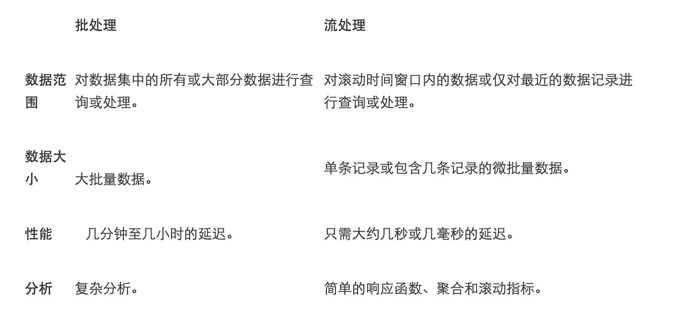

# middleware
practices with middleware

## message queue

1. kafka
   流式处理平台，用于构建实时数据管道和流式处理数据。
2. rabbitmq
   分布式消息代理，多来源收集流式处理数据，然后路由到不同的目标。

### 流数据

连续、增量方式发送的数据，目标是低延迟处理。
提取数据序列，增量式更新指标、报告和汇总统计数据，以响应每个到达的数据记录。

### 模式
#### 点对点
#### 发布订阅（pub-sub）

### kafka关键概念

topic(message)->broker(server)->partition(disk)->Offset(file)